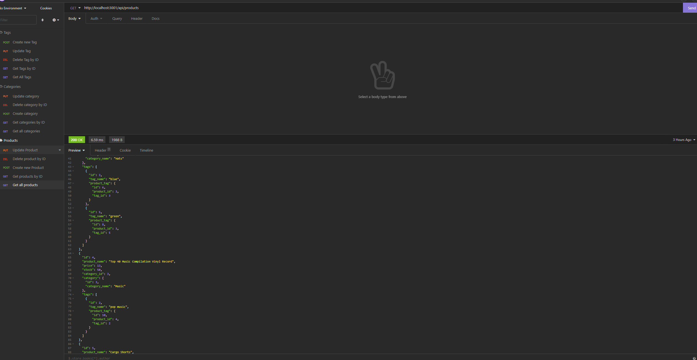

# Ecommerce Back End

This application was built to develop and practice my skills with Node.js, mySQL, and Insomnia. The project was to create and connect a backend for an ecommmerce application.

## Screenshots

## License

[MIT](https://choosealicense.com/licenses/mit/)

## Authors

- [@hamiltondowdy](https://www.github.com/hamiltondowdy) - Reach out to contribute!

## Demo

## Badges

